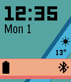
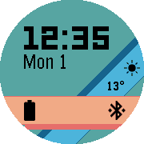

# Material Ribbon for Pebble 
by Turner Vink 
www.turnervink.com

* Inspired by Material Design
* Weather, battery, and Bluetooth information using Material icons
* Supports English, French, Spanish, German, Russian, Italian, Portuguese, and Ukrainian
* Colour schemes
* View battery as an icon or a percentage
* Set a step goal and view progress as the shadow of the horizontal bar

Weather icons from <a href=http://ionicons.com/>Ionicons</a>

Download on the Pebble app store:
https://apps.getpebble.com/en_US/application/56afc52e3076f5d16e000050
